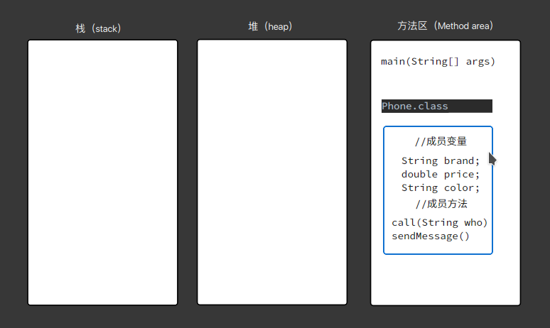
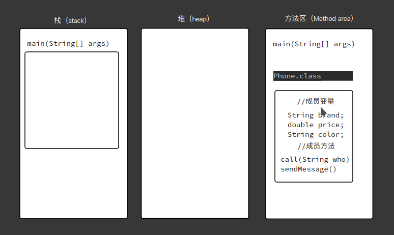
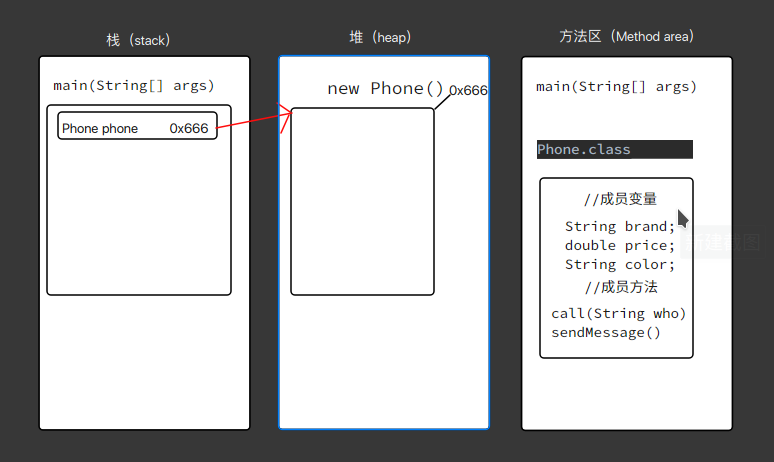
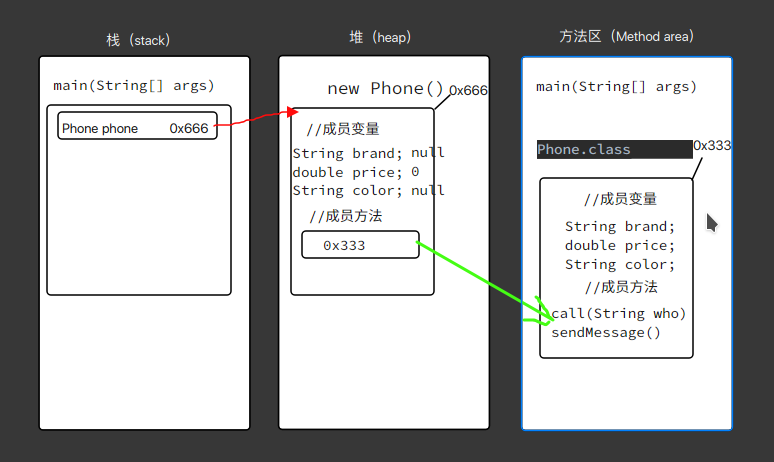
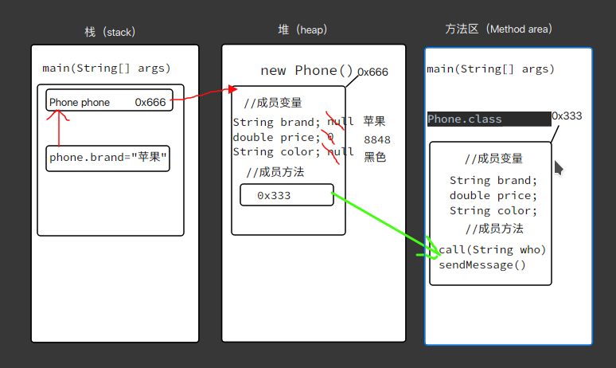
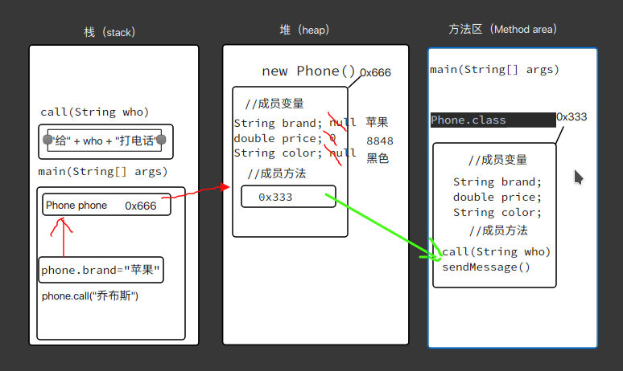
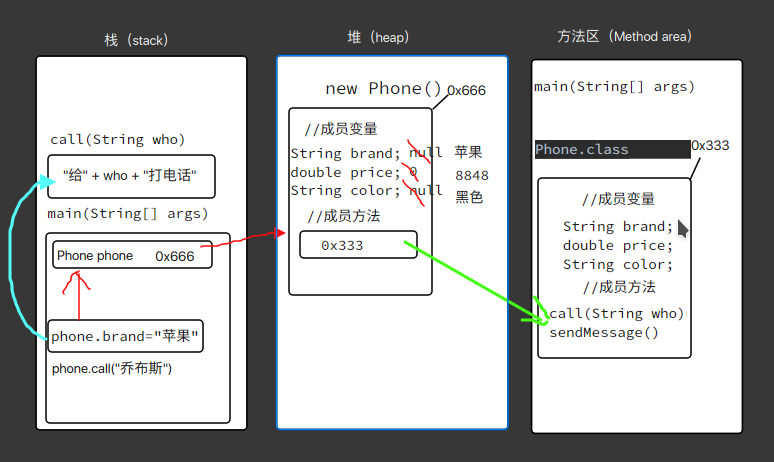

# 面向对象思想概述

面向对象三大特征：封装、继承和多态。

# 一个对象的内存图

## 代码

```java
public class Demo02PhoneClass {
    public static void main(String[] args) {
        Phone phone = new Phone();
        System.out.println(phone.brand);
        System.out.println(phone.price);
        System.out.println(phone.color);
        phone.brand = "苹果";
        phone.price = 8848;
        phone.color = "黑色";
        phone.call("乔布斯");
        phone.sendMessage();
    }
}
```

## 内存分析

方法区包含了一些.class 文件。



main()方法首先执行，进入栈内，栈为其开辟一片新的内存空间。



Phone phone = new Phone()在堆中创建了一个新的Phone对象。栈中存储着该对象的引用。



同时，堆中的Phone对象包含了成员变量和成员方法。成员变量存储的是默认值，成员方法存储的是方法区中成员方法的地址。



根据地址可以访问其中的值。

```
phone.brand = "苹果";
phone.price = 8848;
phone.color = "黑色";
```

上面三句代码依次通过栈中对象的引用将堆中对象的brand值改为苹果，将prince改为8848，将color改为黑色。



phone.call(“乔布斯”)调用方法区的call方法，call方法入栈。





方法执行完毕，call方法出栈。

phone.sendMessage()调用方法区sendMessage方法，sendMessage进栈，打印消息。方法执行完毕，sendMessage出栈。全部执行完毕，main方法出栈。

# 封装性在Java中的体现

方法是一种封装，关键字private也是一种封装。

封装就是将一些细节信息隐藏起来，对于外界不可见。

# 标准类

所有的成员变量都要使用private修饰

为每一个成员变量编写一对Getter/Setter方法

编写一个无参构造方法和全参构造方法

这样的标准类也叫做Java Bean

