# Scanner类

## 功能

可以实现键盘输入数据到程序中。

### 引用类型的一般使用步骤：

1、导包：

​	import 包路径.类名称

​	如果需要使用的目标类和当前类位于同一个包，则可以省略导包语句。只有java.lang包下的内容不需	要导包，其他的包都需要import语句

2、创建：

​	类名称 对象名 = new 类名称（参数列表）；

3、使用：

​	对象名.成员方法名（）

## 使用

Scanner sc = new Scanner(System.in);//没有无参构造，参数System.in表示从键盘读取输入

sc.nextInt();//读入键盘输入的整数值

sc.next();//读入键盘输入的字符串

# 匿名对象

匿名对象就是只有右边的对象，没有左边的名字和赋值运算符：new 类名称();

注意事项：匿名对象只能使用唯一的一次，下次再用不得不再创建一个新对象。

使用建议：如果确定有一个对象只需要使用唯一的一次，就可以使用匿名对象。

# ArrayList集合类

数组的长度不可以发生改变，但是ArrayList集合的长度是可以随意变化的。

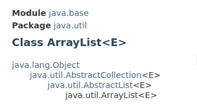

上图的 <E> 表示泛型。

泛型只能是引用类型，不能是基础类型。

泛型就是定义一种模板，例如`ArrayList<T>`，然后在代码中为用到的类创建对应的`ArrayList<类型>`

```java
public class ArrayList<T> {
    private T[] array;
    private int size;
    public void add(T e) {...}
    public void remove(int index) {...}
    public T get(int index) {...}
}
```

```java
// 创建可以存储String的ArrayList:
ArrayList<String> strList = new ArrayList<String>();
// 创建可以存储Float的ArrayList:
ArrayList<Float> floatList = new ArrayList<Float>();
// 创建可以存储Person的ArrayList:
ArrayList<Person> personList = new ArrayList<Person>();
```

对于ArrayList来说，直接打印得到的不是地址值，而是其中的内容；如果ArrayList为空，则得到的是:**[]**

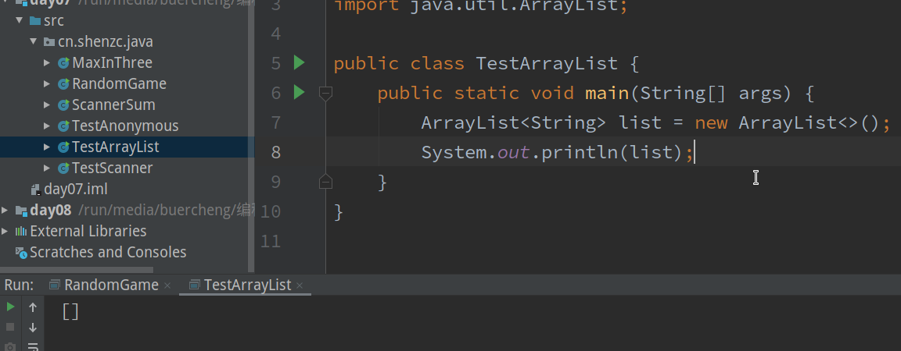																		为空时

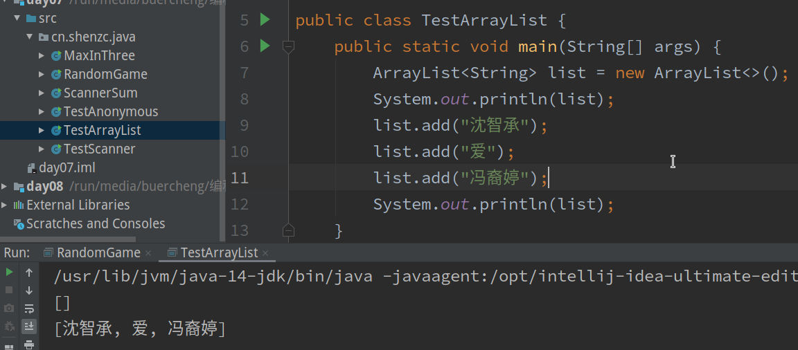

## 常用方法

public boolean add(E e):向集合中添加元素。参数类型和泛型一致。

​		**对于ArrayList的add方法来说，添加元素一定是成功的，返回值可用可不用，但是对于其他集合来说，添加元素不一定成功**

public E  get(int index):从集合中获取元素，参数是索引编号。

public E  remove(int index):从集合中删除元素。

public int size():获取集合的尺寸长度，返回值时集合中元素个数。

# String类

## 字符串的特点

1. 字符串的内容永不可变
2. 因为字符串不可变，所以字符串可以共享使用
3. 字符串效果上相当于char数组，但是底层实现是byte数组

## 创建字符串的常见方法

### 三种构造方法

public String():创建一个空白字符串，不含有任何内容

public String(char[] array):根据字符数组的内容，来创建对应的字符串

public String(byte[] array):根据字节数组的内容，来创建对应的字符串

### 直接创建

String str = ".......内容......";

### 创建示例

```java
package cn.shenzc.java;

public class TestString {
    public static void main(String[] args) {
        //无参构造创建字符串
        String s1 = new String();
        System.out.println(s1);

        //利用char数组构造字符串
        char[] c = {'J','a','v','a'};
        String s2 = new String(c);
        System.out.println(s2);

        //利用字节数组创建字符串
        byte[] b = {97,98,99};
        String s3 = new String(b);
        System.out.println(s3);
    }
}
```

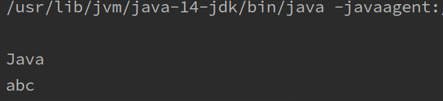

## 字符串常量池

由于字符串是不可变的，所以字符串是可以共享的，由此引出字符串常量池。只要是直接用双引号生成的字符串都位于字符串常量池中，是可以共享的。

```java
public class TestStringPool {
    public static void main(String[] args) {
        String s1 = "Shen";
        String s2 = "Shen";
        char[] c = {'S','h','e','n'};
        String s3 = new String(c);

        System.out.println(s1 == s2);
        System.out.println(s1 == s3);
        System.out.println(s2 == s3);
    }
}
```

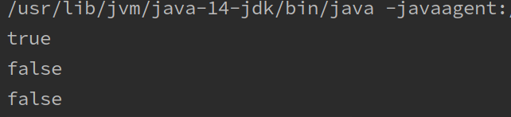

对于基本类型来说，==是进行值比较；对于引用类型来说是地址比较。

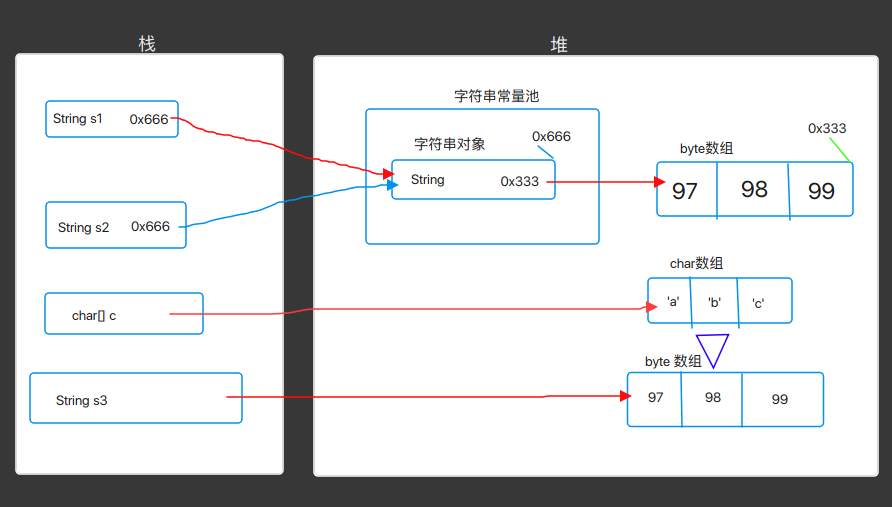

## equals和equalsIgnoreCase方法

==是进行对象的地址值比较，如果确实需要比较字符串的内容，可以使用equals和equalsIgnoreCase方法。

### public boolean equals(Object obj)

参数可以是任何对象，只有参数是一个字符串并且内容相同时才返回true。

注意：

1. 任何对象都能用Object进行接收
2. equals方法具有对称性，a.equals(b)等价于b.equals(b)
3. 如果比较一个常量一个变量，推荐把常量字符串写在前面（如果变量写前面可能会报空指针异常NullPointerException）

```java
package cn.shenzc.java;

public class TestEquals {
    public static void main(String[] args) {
        String s1 = null;
        String s2 = new String("Hello");
        //推荐   常量.equals(变量)
        System.out.println(s1.equals(s2));
        //不推荐  变量.equals(常量)
        System.out.println(s2.equals(s1));
    }
}
```

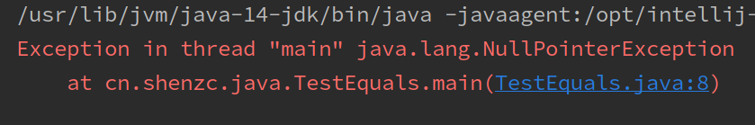

### public boolean equalsIgnoreCase(Object obj)

忽略大小写

## 其他方法

public int length():获取字符串中字符个数

public String concat(String str):返回当前字符串和参数连接成的新字符串

public char charAt(int index):获取指定位置的字符

public int indexOf(String str):查找参数字符串在当前字符串中首次出现的位置，如果不存在，则返回-1

## 字符串的截取方法

public String substring(int index):由参数位置一直到结尾的子字符串

public String substring(int start,int begin):start到begin，不包括begin的子字符串

## 字符串的转换相关方法

public char[] toCharArray():将当前字符串拆分为字符数组并返回

public byte[] getBytes():获得当前字符串底层的字符数组

public String replace(CharSequence OldString,CharSequence NewString):将所有出现的老字符串用新字符串代替，并返回修改后的字符串

## 字符串分割方法

public String[] split(String regx):按照参数的规则，将字符串切分成若干部分。

注意：该方法的参数实则是一个正则表达式，如果要用“.”来进行分割的话，必须填入`“\\.”`

```java
package cn.shenzc.java;
public class TestSplit {
    public static void main(String[] args) {
        String str1 = "aaa,bbb,ccc";
        String[] array1 = str1.split(",");
        for (int i = 0; i < array1.length; i++) {
            System.out.println(array1[i]);
        }
    }
}
```

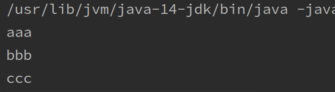

```java
package cn.shenzc.java;
public class TestSplit {
    public static void main(String[] args) {
        String str1 = "aaa.bbb.ccc";
        String[] array1 = str1.split(".");
        System.out.println(array1.length);
        for (int i = 0; i < array1.length; i++) {
            System.out.println(array1[i]);
        }
    }
}
```

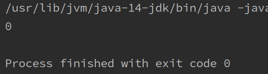

```java
package cn.shenzc.java;
public class TestSplit {
    public static void main(String[] args) {
        String str1 = "aaa.bbb.ccc";
        String[] array1 = str1.split("\\.");
        System.out.println(array1.length);
        for (int i = 0; i < array1.length; i++) {
            System.out.println(array1[i]);
        }
    }
}
```

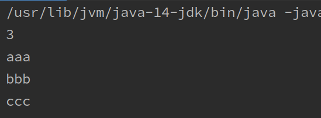

# static关键字

## static修饰成员变量

## static修饰成员方法

1、静态不能直接访问非静态。因为在内存中先有静态内容，后有非静态内容。

2、对于本类当中的静态方法，可以省略类名称。

3、静态方法中不能使用this关键字。因为this代表当前对象。

4、推荐使用  类名.静态成员  的方法调用静态成员。

## 静态代码块

static{//静态代码块内容}

静态内容总是优先于费静态内容，所以类中的静态代码块先于构造方法执行。

### 典型用途

用来一次性的对静态成员变量进行赋值。

# 数组工具类Arrays

## 定义

java.util.Arrays是一个与数组相关的工具类，提供了大量的静态方法，用来实现数组常见的操作。

## 常用方法

### public static String toString(数组): 

将参数数组变成字符串。格式：[元素1，元素2，...]

```java
package cn.shenzc.java;
import java.util.Arrays;
public class TestArrays {
    public static void main(String[] args) {
        int[] array1 = {1,3,2,14,12,76,34};
        System.out.println(Arrays.toString(array1));
        String[] array2 = {"shen","zhi","cheng"};
        System.out.println(Arrays.toString(array2));
    }
}
```

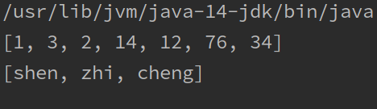

### public static void sort(数组)：

按照默认升序对数组元素进行排序。

```java
package cn.shenzc.java;

import java.util.Arrays;

public class TestArrays {
    public static void main(String[] args) {
        int[] array1 = {1,3,2,14,12,76,34};
        System.out.println(Arrays.toString(array1));
        String[] array2 = {"shen","zhi","cheng"};
        System.out.println(Arrays.toString(array2));

        System.out.println("===============");
        System.out.println("排序：");
        Arrays.sort(array1);
        System.out.println(Arrays.toString(array1));
        Arrays.sort(array2);
        System.out.println(Arrays.toString(array2));
    }
}
```

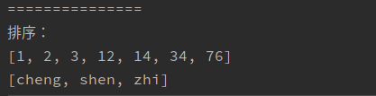

# 数学工具类Math

## 定义

java.lang.Math是数学相关的工具类，提供了大量的静态方法，完成与数学相关的操作。

## 常用方法 

public static double abs(double num):获取绝对值

public static double ceil(double num):向上取整

public static double floor(double num):向下取整

public static long round(double num):四舍五入

