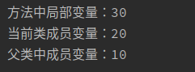
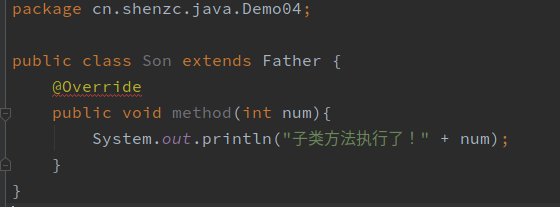

# 继承

## 继承中成员变量访问特点

在父子类的继承关系中，如果成员变量重名，则创建子类对象时，访问有两种方式：

1. 直接通过子类对象访问成员变量：等号左边是谁，就优先用谁，如果没有则去父类中找；
2. 间接通过成员方法访问:该方法属于谁，就优先用谁，没有就往父类找。

```java
//Father.java
package cn.shenzc.java.Demo01;
public class Father {
    int num = 10;
    public void getNum(){
        System.out.println(num);
    }
}
```

```java
//Son.java
package cn.shenzc.java.Demo01;
public class Son extends Father{
    //int num = 20;
    public void getNum(){
        System.out.println(num);
    }
}
```

```java
//TestVar.java
package cn.shenzc.java.Demo01;
public class TestVar {
    public static void main(String[] args) {
        //直接访问成员变量，如果当前类包含该变量，则优先访问当前类的这个变量；
        // 如果当前类没有该变量，则往上去父类找；
        //如果父类也没有该变量，则编译出错。
        Son son = new Son();
        System.out.println(son.num);

        //通过方法间接访问成员变量，如果当前类包含该变量，则优先访问当前类的这个变量；
        // 如果当前类不包含该变量，则往上去父类找；
        //如果父类也没有该变量，则编译出错。
        son.getNum();
    }
}
```

## 父类成员变量、子类成员变量、方法中局部变量三者重名

局部变量：直接写

子类（当前类）成员变量：this.变量名

父类成员变量：super.变量名

```java
//Father.java
package cn.shenzc.java.Demo02;
public class Father {
    int num = 10;
}
```

```java
//Son.java
package cn.shenzc.java.Demo02;
public class Son extends Father{
    int num = 20;
    public void localTest(){
        int num = 30;
        System.out.println("方法中局部变量：" + num);
        System.out.println("当前类成员变量：" + this.num);
        System.out.println("父类中成员变量：" + super.num);
    }
}
```

```java
//Test.java
package cn.shenzc.java.Demo02;
public class Test {
    public static void main(String[] args) {
        Son son = new Son();
        son.localTest();
    }
}
```



## 继承中成员方法的访问特点

在父子类的继承关系中，创建子类对象，访问成员方法的规则：创建的对象是谁，就优先用谁，如果没有则向上找。

无论是成员方法还是成员变量，如果当前类不包含只会向上去父类找，绝不会向下去子类找。

## 重写

### 概念

继承关系中，子类中的方法与父类中方法名、参数列表都一致。重写（Override），也叫覆写，覆盖。

### 用法

创建的是子类对象，则优先用子类方法。

### 注意事项

1、必须保证父子类之间方法名称相同，参数列表也相同。

​	@Override（注解）：写在方法前面，用来检测是不是有效的正确覆盖重写

```java
package cn.shenzc.java.Demo04;
public class Father {
    public void method(){
        System.out.println("父类方法执行了！");
    }
}
```

```java
package cn.shenzc.java.Demo04;
public class Son extends Father {
    @Override
    public void method(int num){
        System.out.println("子类方法执行了！" + num);
    }
}
```

添加了@Override，如果没有正确重写就会报错：



2、子类方法的返回值必须小于等于父类方法的返回值类型。

​	例如：父类方法的返回值是Object类（所有类的根基类），则子类方法的返回值可以是Object类，也可以是String类；

​	但是如果父类方法的返回值是String类，子类方法的返回值为Object类是不行的。

3、子类方法的权限修饰符必须大于等于父类方法的权限修饰符。

​	public  >  protected   >  default  >    private

### 设计原则

对于已经投入使用的类，尽量不要修改，推荐定义一个新的类，来重复利用其中共性内容，并且添加新内容。

## 继承中的构造方法

子类构造中有一个默认隐含的super()构造方法，所以是先调用父类构造方法再执行子类构造方法；子类构造方法也可以通过super关键字调用父类有参构造方法；super必须位于子类构造方法的第一行，而且每个子类构造方法只能调用一次；子类的成员方法不能使用super()构造方法。

### super的三种用法

1. 在子类的成员方法中访问父类的成员变量
2. 在子类的成员方法中访问父类的成员方法
3. 在子类的构造方法中访问父类的构造方法

### this关键字的三种用法

1. 在本类的成员方法中访问本类的成员方法
2. 在本类的成员方法中，访问本类的另一个成员方法
3. 在本类的构造方法中，访问本类的另一个构造方法（必须是构造方法的第一行）（super和this两种构造调用不能同时使用）

## Java继承的三个特点

1、Java语言是单继承的。直接父类只能有唯一一个；

2、Java语言可以多级继承。

3、一个子类的父类是唯一的，但是一个父类可以有多个子类。

# 抽象类

## 概念

抽象方法：只需定义不需实现的方法。`public abstract void method name();` 

抽象类：包含抽象方法的类必须是抽象类。`public abstract class ClassName{	//类内容 	}`

## 用法

抽象类不能实例化。必须用一个子类来继承抽象父类，子类必须覆盖重写抽象父类中的所有抽象方法（去掉abstract关键字，然后加上方法体）。