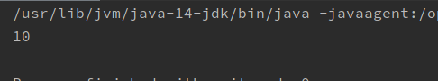
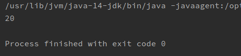
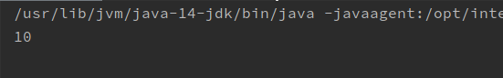

# 多态概述

extends继承或者implements实现是多态性的前提。

一个对象拥有多种形态，（例如学生对象既属于人这个类，也属于学生类。）这就是对象的多态性。

# 多态的格式与使用

父类引用指向子类对象。

父类名称 对象名 = new 子类名称();

接口名称 对象名  =  new 实现类名称();

对象名.方法名可以调用子类中的方法，如果子类中不存在该方法就去父类中找。

# 多态中的成员变量使用特点

与普通成员变量使用特点一致

1、直接通过对象名称访问成员变量：看等号左边是谁，优先用谁，如果没有则向上找。

2、间接通过成员方法访问成员变量：看该方法属于谁，优先用谁，如果没有则向上找。

```java
//Father.java
package cn.shenzc.cn.Demo01;
public class Father {
    //父类成员变量
    int num = 10;
}
```

```java
//Son.java
package cn.shenzc.cn.Demo01;

public class Son extends Father{
    //子类成员变量
    int num = 20;
}
```

```java
package cn.shenzc.cn.Demo01;
public class TestPoly {
    public static void main(String[] args) {
        Father fSon = new Son();
        System.out.println(fSon.num);
    }
}
```



等号左边是Father,所以优先使用父类成员变量。

```java
package cn.shenzc.cn.Demo01;
public class Father {
    //父类成员变量
    int num = 10;
    public void showNum(){
        System.out.println(num);
    }
}
```

```java
package cn.shenzc.cn.Demo01;
public class Son extends Father{
    //子类成员变量
    int num = 20;
    public void showNum(){
        System.out.println(num);
    }
}
```

```java
package cn.shenzc.cn.Demo01;
public class TestPoly {
    public static void main(String[] args) {
        Father fSon = new Son();
        fSon.showNum();
    }
}
```



子类重写覆盖了就是子类中的成员变量。

```java
package cn.shenzc.cn.Demo01;
public class Son extends Father{
    //子类成员变量
    int num = 20;
}
```



子类没有重写覆盖则是父类的成员变量。

# 多态中成员方法的访问规则

在多态中，成员方法的访问规则是：看new的是谁，就优先用谁，没有就向上找。

编译看左边，运行看右边。看下面代码：

```java
package cn.shenzc.cn.Demo01;

public class Father {
    //父类成员方法
    public void method(){
        System.out.println("父类成员方法");
    }
    //父类特有成员方法
    public void fatherMethod(){
        System.out.println("父类特有成员方法");
    }
}
```

```java
package cn.shenzc.cn.Demo01;

public class Son extends Father{
    //重写父类方法

    @Override
    public void method() {
        System.out.println("重写父类方法");
    }

    //子类特有成员方法
    public void subMethod(){
        System.out.println("子类成员方法");
    }
}
```

```java
package cn.shenzc.cn.Demo01;
public class TestPoly {
    public static void main(String[] args) {
        Father fSon = new Son();
        fSon.method();
        fSon.fatherMethod();
       // fSon.subMethod();错误写法
    }
}
```

在TestPoly中，第4行new的是Son对象，所以当fSon对象调用method方法时，即使父类，子类都有method方法，但是会优先调用子类method方法，只有当子类不存在该方法时，向上去父类找。

第6行，编译看左边，左边是Father fSon，属于父类对象，没有subMethod方法，所以编译报错。

运行看右边，第4行右边new的是一个Son对象，fSon调用method方法时，优先执行Son、中的method方法。

**成员变量：编译看左边，运行也看左边**

**成员方法：编译看左边，运行看右边**

# 对象的向上转型

其实就是多态写法。

格式：父类名称 对象名称 = new 子类名称();

含义：右侧创建一个子类对象，把它当做父类来看待使用。

注意事项：向上转型一定是安全的，从小范围转向了大范围。类似于int---->double的自动类型转换

对象一旦向上转型为父类，就无法调用子类特有的方法

# 对象的向下转型

对象的向下转型，其实是一种还原过程。

格式：子类名称 对象名 = （子类名称）父类对象;

含义：将（向上转型的）父类对象，还原成本来的子类对象。

类似于强制类型转换。

 