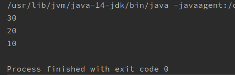
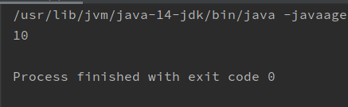
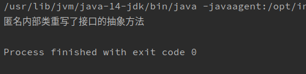

# final关键字

## 概念与四种用法

final关键字代表最终的、不可改变的。

常见四种用法：

1. 可以用来修饰一个类
2. 可以用来修饰一个方法
3. 可以用来修饰一个局部变量
4. 可以用来修饰一个成员变量

## final修饰类

### 格式

public final class ClassName{....}

### 含义

final类不能有子类（太监类。）。

### 注意

如果一个类为final类，则其中的所有方法都不能覆盖重写。

但是，对于这个final类从父亲继承的方法，是可以在这个final类中进行覆盖重写的。

## final修饰方法

### 格式

public final void methodName(argument list){......}

### 含义

final修饰一个方法，表明这个方法是最终方法，不能被覆盖重写。

### 注意

对于方法和类来说，abstract关键字和final关键字不能同时使用。因为会产生矛盾。

## final修饰局部变量

### 格式

final int varName = value;

final int varName; varName = value;

### 含义

一旦使用final来修饰局部变量，那么这个变量就不能再进行更改；

对于基本类型来说：不可变说的是变量中的数据不可改变

对于引用类型来说，不可变说的是变量中的地址不可改变

## final修饰成员变量

由于成员变量具有默认值，所以使用final关键字后必须手动赋值，而不会再自动赋值了；

对于final成员变量，要么使用直接赋值，要么使用构造器赋值；

使用构造器赋值时，必须确保每个构造器都对final成员变量进行了赋值。

# 权限修饰符

# 内部类

如果一个事物内部包含另一个事物，那么这就是一个类内部包含另一个类。例如：身体和心脏的关系，汽车和发动机的关系。

## 分类

内部类分为成员内部类和局部内部类，局部内部类又包含匿名内部类；

## 成员内部类

### 定义格式

```java
权限修饰符  class 外部类名称{
		权限修饰符  class  内部类名称{
		//......
		}
		//.......
		}
```

### 注意

内部类随意使用外部类的属性和方法，不用考虑其权限修饰符；外部类要使用内部类，必须根据内部类对象来使用。

## 成员内部类使用

### 间接使用

在外部类的方法中，使用内部类；然后在main方法中只调用外部类方法

### 直接使用

公式：外部类.内部类  对象名称  =  new   外部类().new   内部类();

## 内部类重名变量访问

```java
package cn.shenzc.java.InnerClass;

public class Outer {
    int num = 10;//外部类的成员变量
    public class Inner{
        int num = 20;//内部类成员变量
        public void methodInner(){
            int num = 30;//内部类局部变量
            System.out.println(num);//访问内部类局部变量
            System.out.println(this.num);//访问内部类成员变量
            System.out.println(Outer.this.num);//访问外部类成员变量
        }
    }
}
```

```java
package cn.shenzc.java.InnerClass;

public class Test {
    public static void main(String[] args) {
        //直接使用内部类
        //外部类.内部类  对象名称  =  new  外部类().new  内部类();
        Outer.Inner obj = new Outer().new Inner();
        obj.methodInner();
    }
}
```



## 局部内部类

### 定义

如果一个类是定义在方法内部的，那么它就是一个局部内部类

### 格式

```java
修饰符 class 外部类名称{
修饰符 返回值 外部方法名（参数列表）{
	class  局部内部类名称{
	         修饰符 返回值 局部内部类方法名称（参数列表）{
	         //方法体
	         }
	}
	//其他方法体
}
}
```

### 使用

局部内部类只能在方法内部使用。

```java
package cn.shenzc.java.InnerClass.Demo02;

public class Outer {
    public void outerMethod(){
        //局部内部类
        //不能有任何修饰符（不是default）
        class Inner{
            //局部内部类成员变量
            int num = 10;
            //局部内部类方法
            public void show(){
                System.out.println(num);
            }
        }
        //局部内部类只能在方法中使用
        Inner obj = new Inner();
        obj.show();
    }
}
```

```java
package cn.shenzc.java.InnerClass.Demo02;

public class Test {
    public static void main(String[] args) {
        Outer outer = new Outer();
        outer.outerMethod();
    }
}
```



### 注意

局部内部类访问方法的成员变量时，这个成员变量必须是真实final的。

从Java8开始，final可以省略，但是得保证成员变量不会再改变。

原因：

1、变量是定义在栈里面的

2、而对象是定义在堆里面的

定义的变量随着方法执行完毕，出栈后就不可以使用了；但是堆里面的对象还存在，等待着垃圾回收，但是堆里面的对象可能还会调用已经不存在的变量，所以必须把成员变量设置为final，这样这一成员变量就是常量，存在于常量池中，不会因为方法出栈而消失。

## 类的权限修饰符

public  >   protected   >   (default)   >     private

1、外部类：public、（default）

2、内部类：public、 protected、default)、private

3、局部内部类：没有任何修饰符（不是default）

## 匿名内部类☆

如果接口的实现类（或是父类的子类）只需要使用唯一的一次，那么这种情况下，可以省略该类的定义，使用匿名内部类；

定义格式：

接口名称   对象名称   =   new    接口名称(){

//覆盖重写所有抽象方法

}； 

```java
package cn.shenzc.java.InnerClass.Demo03;

public interface InnerAnony {
    public abstract void method();
}
```

```java
package cn.shenzc.java.InnerClass.Demo03;

public class Test {
    public static void main(String[] args) {
        InnerAnony obj = new InnerAnony() {
            @Override
            public void method() {
                System.out.println("匿名内部类重写了接口的抽象方法");
            }
        };
        obj.method();
    }
}
```



### 注意事项

对格式：

new 接口名称(){......};

进行解析。

1、new代表创建对象的动作；

2、接口名称就是匿名内部类要实现哪个接口；

3、大括号内的才是匿名内部类的实现内容。

另外：

1、匿名内部类在创建对象的时候只能使用唯一的一次；如果希望多次创建对象，而且对象的内容一致，那就必须定义单独的实现类了；

2、匿名对象在调用方法的时候只能调用唯一的一次；如果希望一个对象调用多次方法，就必须给方法取个名称；

3、匿名内部类是省略了实现类或子类，匿名对象是省略了对象名称；

所以匿名内部类和匿名对象不是一回事。


