# Object类

## 概述

`java.lang.Object`类是Java语言中的根类，即所有类的父类。它中描述的所有方法子类都可以使用。在对象实例化的时候，最终找的父类就是Object。

## toString方法

### 方法描述

```java
public String toString();
```

Returns: a string representation of the object.

返回的是：getClass().getName() + '@' + Integer.toHexString(hashCode()) ，也就是包名+‘@’+地址值的哈希值

### 代码演示

```java
package cn.shenzc.java.demo01;
public class TestObject {
    public static void main(String[] args) {
        Person p1 = new Person();
        System.out.println(p1.toString());
        System.out.println(p1);
    }
}
```

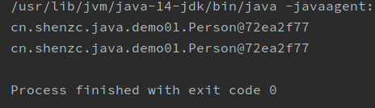

toString方法默认是打印当前对象的地址值，与直接打印对象名称一样，这样做没有意义，所以需要对toString方法进行重写。

### 重写toString方法

```java
package cn.shenzc.java.demo01;

public class Person{
    private String name;
    private int age;

    @Override
    public String toString() {
        return "Person{name:" + name + " age:" + age + "}";
    }

    public Person() {
    }

    public Person(String name, int age) {
        this.name = name;
        this.age = age;
    }

    public String getName() {
        return name;
    }

    public void setName(String name) {
        this.name = name;
    }

    public int getAge() {
        return age;
    }

    public void setAge(int age) {
        this.age = age;
    }
}
```

由于调用的是无参构造，所以最后输出默认值null和0.

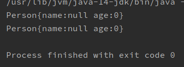

## equals方法

### 方法描述

```java
public boolean equals(Object obj)
```

Returns: true` if this object is the same as the obj argument; `false otherwise.

默认情况下，基本数据类型比较的是数据值是否相等，引用数据类型比较的是对象的地址值是否相等。

对任意**非null对象**：

1、x.equals(x)总是返回true

2、x.equals(y)当且仅当y.equals(x)返回true时，结果为true

3、如果x.equals(y)、y.equals(z)为true，那么x.equals(z)也为true

4、x,y不发生改变的情况下，x.equals(y)总是返回true或总是返回false

5、x.equals(null)总是返回false

### 代码演示

```java
package cn.shenzc.java.demo02;

public class TestEquals {
    public static void main(String[] args) {
        Person p1 = new Person("迪丽热巴",18);
        Person p2 = new Person("古力娜扎",19);
        System.out.println(p1.equals(p2));
    }
}
```

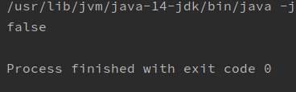

```java
package cn.shenzc.java.demo02;

public class TestEquals {
    public static void main(String[] args) {
        Person p1 = new Person("迪丽热巴",18);
        Person p2 = new Person("迪丽热巴",18);
        System.out.println(p1.equals(p2));
    }
}
```


```java
package cn.shenzc.java.demo02;

public class TestEquals {
    public static void main(String[] args) {
        Person p1 = new Person("迪丽热巴",18);
        Person p2 = p1;
        System.out.println(p1.equals(p2));
    }
}
```

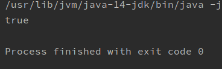

### 重写equals方法

如果希望比较两个对象的内容，而不是地址值，那么需要对equals方法进行重写。

```java
package cn.shenzc.java.demo02;

public class Person{
    private String name;
    private int age;

    @Override
    public boolean equals(Object obj) {
        //如果传入的对象为null,则直接返回false
        if(obj == null)
            return false;
        //如果传入的对象是本身的话，则返回true
        if(obj == this)
            return true;
        //如果传入的是Person对象，则向下转型进行值得比较；如果不是Person类型，则返回false
        if(obj instanceof Person)
        {
            Person p = (Person)obj;
            if(p.age == this.age && this.name.equals(p.name))//String重写了equals方法
                return true;
            else
                return false;
        }
        else
            return false;
    }

    public Person() {
    }

    public Person(String name, int age) {
        this.name = name;
        this.age = age;
    }

    public String getName() {
        return name;
    }

    public void setName(String name) {
        this.name = name;
    }

    public int getAge() {
        return age;
    }

    public void setAge(int age) {
        this.age = age;
    }
}
```

更好的方法是自动生成重写的equals方法

```java
@Override
    public boolean equals(Object o) {
        //如果传入的是本身，则返回true
        if (this == o) return true;
        //如果传入的是null，或者与调用方法的对象不属于同一类，则返回false
        if (o == null || getClass() != o.getClass()) return false;//getClass 返回当前对象的类名称，使用反射技术判断o是否是											//	Person类型
        //向下转型
        Person person = (Person) o;
        //比较属性是否相等
         return age == person.age &&
                Objects.equals(name, person.name);
    }
```

## Objects类的equals方法

### Objects类介绍

This class consists of `static` utility methods for operating on objects, or checking certain conditions before operation. These utilities include **`null`-safe** or **`null`-tolerant** methods for computing the hash code of an object, returning a string for an object, comparing two objects, and checking if indexes or sub-range values are out of bounds.

在比较两个对象的时候，Object的equals方法容易抛出空指针异常，而Objects类中的equals方法就优化了这个问题。

### 代码演示

```java
package cn.shenzc.java.demo03;

public class TestNullPointer {
    public static void main(String[] args) {
        String s1 = null;
        String s2 = "abc";
        //此时s1调用Object类的equals方法，会产生空指针异常 NullPointerException
        s1.equals(s2);
    }
}
```

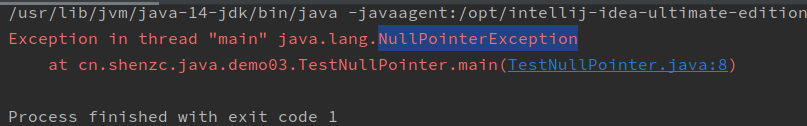

使用Objects类的equals方法，则不会出现空指针异常

```java
package cn.shenzc.java.demo03;

import java.util.Objects;

public class TestNullPointer {
    public static void main(String[] args) {
        String s1 = null;
        String s2 = "abc";
        //此时s1调用Object类的equals方法，会产生空指针异常 NullPointerException
        //s1.equals(s2);
        System.out.println(Objects.equals(s1,s2));
    }
}
```

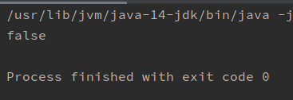

# Date类

## 毫秒值的概念和作用

1秒（s） =   1000毫秒（ms）

毫秒值可以对时间和日期进行计算。Java中是把时间和日期转换为相对于时间原点（1979-01-01-00：00）所过的毫秒值来计算过了多少天的。

System.currnetTimeMillis()方法可以用来获取当前时间到时间原点总共经过了多少毫秒。

```java
package cn.shenzc.java.demo04;

public class TestMiSe {
    public static void main(String[] args) {
        System.out.println(System.currentTimeMillis());
    }
}
```


中国属于东八区，所以对应的时间原点是1970-01-01-08：00.

## Date类的构造方法

Date类表示的是一个精确的瞬时时间，精确到毫秒。

### public Date()

无参构造

创建一个Date对象，并且初始化为创建时的时间，精确到毫秒。

```java
package cn.shenzc.java.demo04;

import java.util.Date;

public class TestDate {
    public static void main(String[] args) {
        Date date = new Date();
        System.out.println(date);
    }
}
```

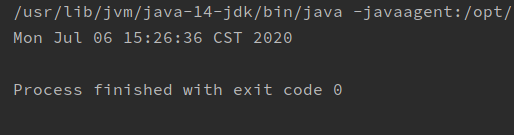

### public Date(long date)

创建一个Date对象，并把时间设为传入的long值（表示毫秒）相对于时间原点表示的时间。

```java
package cn.shenzc.java.demo04;

import java.util.Date;

public class TestDate {
    public static void main(String[] args) {
        Date date = new Date(1594020673079L);//1594020673079由System.currentTimeMillis()生成
        System.out.println(date);
    }
}
```

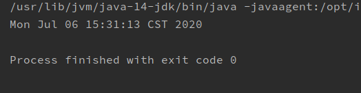

## Date类的成员方法

### public long getTime()

返回当前对象表示的时间到时间原点经过的毫秒数。

```java
package cn.shenzc.java.demo04;

import java.util.Date;

public class TestGetTime {
    public static void main(String[] args) {
        Date date = new Date();
        System.out.println(date.getTime());
    }
}
```

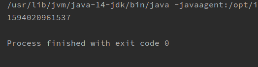

## DateFormat类

`java.text.DateFormat` 是日期/时间格式化子类的**抽象类**，我们通过这个类可以帮我们完成日期和文本之间的转换,也就是可以在Date对象与String对象之间进行来回转换。

**格式化**：按照指定的格式，从Date对象转换为String对象。

**解析**：按照指定的格式，从String对象转换为Date对象。

### 构造方法

由于DateFormat为抽象类，不能直接使用，所以需要常用的子类`java.text.SimpleDateFormat`。这个类需要一个模式（格式）来指定格式化或解析的标准。构造方法为：`public SimpleDateFormat(String pattern)`：用给定的模式和默认语言环境的日期格式符号构造SimpleDateFormat。参数pattern是一个字符串，代表日期时间的自定义格式。

常用的模式规则

| 字母 |         表示         |
| :--: | :------------------: |
|  y   |         年份         |
|  M   |         月份         |
|  d   |      日（月份）      |
|  H   | 小时（24小时制0-23） |
|  m   |      分（小时）      |
|  s   |       秒（分）       |
|  S   |         毫秒         |

更多规则可以见API文档

### 成员方法

- `public String format(Date date)`：将Date对象格式化为字符串。
- `public Date parse(String source)`：将字符串解析为Date对象。

### 代码演示

```java
package cn.shenzc.java.demo05;

import java.text.SimpleDateFormat;
import java.util.Date;
//把Date对象转化为格式化String字符串
public class TestDateFormat {
    public static void main(String[] args) {
        // 创建日期格式化对象,在获取格式化对象时可以指定风格    yyyy年MM月dd日，HH时mm分ss秒sss
        SimpleDateFormat sdf = new SimpleDateFormat("yyyy年MM月dd日，HH时mm分ss秒sss");
        //创建一个Date对象
        Date date = new Date();
        System.out.println(date);
        //调用SimpleDateFormat的format方法把Date对象转为格式化字符串
        System.out.println(sdf.format(date));
    }
}
```

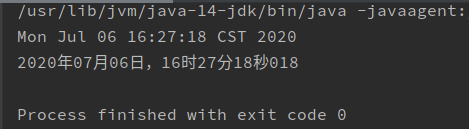

```java
package cn.shenzc.java.demo05;

import java.text.ParseException;
import java.text.SimpleDateFormat;
import java.util.Date;

//把格式化的字符串转换为Date对象
public class TestParse {
    public static void main(String[] args) throws ParseException {//会抛异常
        //创建SimpleDateFormat对象，指定转化模式
        SimpleDateFormat sdf = new SimpleDateFormat("yyyy年MM月dd日，HH时mm分ss秒SSS");
        //创建一个Date对象，接收转换后的对象
        Date date = new Date();
        date = sdf.parse("2020年07月06日，16时27分18秒018");
        System.out.println(date);
    }
}

```

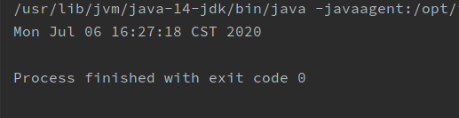

# Calendar类

`java.util.Calendar`是日历类，在Date后出现，替换掉了许多Date的方法。该类将所有可能用到的时间信息封装为**静态成员变量，**方便获取。日历类就是方便获取各个时间属性的。

Calendar为抽象类，由于语言敏感性，Calendar类在创建对象时并非直接创建，而是通过静态方法创建，返回子类对象，如下：

Calendar静态方法

* `public static Calendar getInstance()`：使用默认时区和语言环境获得一个日历

```java
package cn.shenzc.java.demo07;

import java.util.Calendar;

public class TestCalendar {
    public static void main(String[] args) {
        //用Calendar的静态方法，获取一个Calendar的子类对象
        Calendar calendar = Calendar.getInstance();
        System.out.println(calendar);
    }
}
```

```
java.util.GregorianCalendar[time=1594030402648,areFieldsSet=true,areAllFieldsSet=true,lenient=true,zone=sun.util.calendar.ZoneInfo[id="Asia/Shanghai",offset=28800000,dstSavings=0,useDaylight=false,transitions=29,lastRule=null],firstDayOfWeek=1,minimalDaysInFirstWeek=1,ERA=1,YEAR=2020,MONTH=6,WEEK_OF_YEAR=28,WEEK_OF_MONTH=2,DAY_OF_MONTH=6,DAY_OF_YEAR=188,DAY_OF_WEEK=2,DAY_OF_WEEK_IN_MONTH=1,AM_PM=1,HOUR=6,HOUR_OF_DAY=18,MINUTE=13,SECOND=22,MILLISECOND=648,ZONE_OFFSET=28800000,DST_OFFSET=0]
```

## 常用方法

- `public int get(int field)`：返回给定日历字段的值。
- `public void set(int field, int value)`：将给定的日历字段设置为给定值。
- `public abstract void add(int field, int amount)`：根据日历的规则，为给定的日历字段添加或减去指定的时间量。
- `public Date getTime()`：返回一个表示此Calendar时间值（从历元到现在的毫秒偏移量）的Date对象。

## 常用字段

|     字段     |            含义             |
| :----------: | :-------------------------: |
|     YEAR     |             年              |
|    MONTH     |        月（从0开始）        |
| DAY_OF_MONTH |      （该月的第几）天       |
|    HUOUR     |          12小时制           |
| HOUR_OF_DAY  |          24小时制           |
|    MINUTE    |             分              |
|    SECOND    |             秒              |
| DAY_OF_WEEK  | 周几（周日为1，可以使用-1） |

## 代码演示

Calendar.get(int filed)方法

```java
package cn.shenzc.java.demo07;

import java.util.Calendar;

public class TestCalendarMethod {
    public static void main(String[] args) {
        //用Calendar的静态方法，获取一个Calendar的子类对象
        Calendar calendar = Calendar.getInstance();
        int year = calendar.get(Calendar.YEAR);
        int month = calendar.get(Calendar.MONTH) + 1;//从0开始，所以要加1
        int day = calendar.get(Calendar.DAY_OF_MONTH);
        int hour = calendar.get(calendar.HOUR_OF_DAY);
        int min = calendar.get(calendar.MINUTE);
        int sec = calendar.get(calendar.SECOND);
        System.out.println("现在是：" + year + "年" + month + "月" + day + "日" + hour + "时" +
                min + "分" + sec + "秒");
    }
}
```

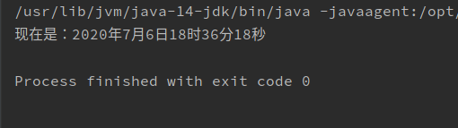

void set(int field, int value)方法

```java
package cn.shenzc.java.demo07;

import java.util.Calendar;

public class TestCalendarMethod {
    public static void main(String[] args) {
        //用Calendar的静态方法，获取一个Calendar的子类对象
        Calendar calendar = Calendar.getInstance();
        int year = calendar.get(Calendar.YEAR);
        int month = calendar.get(Calendar.MONTH) + 1;//从0开始，所以要加1
        int day = calendar.get(Calendar.DAY_OF_MONTH);
        int hour = calendar.get(calendar.HOUR_OF_DAY);
        int min = calendar.get(calendar.MINUTE);
        int sec = calendar.get(calendar.SECOND);
        System.out.println("现在是：" + year + "年" + month + "月" + day + "日" + hour + "时" +
                min + "分" + sec + "秒");
        calendar.set(calendar.YEAR,2021);
        year = calendar.get(Calendar.YEAR);
        System.out.println("现在是：" + year + "年" + month + "月" + day + "日" + hour + "时" +
                min + "分" + sec + "秒");
        calendar.set(Calendar.MONTH,14);//会自动进行取模运算，取得正确的月份
        System.out.println(calendar.get(Calendar.MONTH)); //2
    }
}
```


`public abstract void add(int field, int amount)`

```java
package cn.shenzc.java.demo07;

import java.util.Calendar;

public class TestCalendarMethod {
    public static void main(String[] args) {
        //用Calendar的静态方法，获取一个Calendar的子类对象
        Calendar calendar = Calendar.getInstance();
        calendar.add(Calendar.YEAR,79);
        System.out.println(calendar.get(Calendar.YEAR));
        calendar.add(Calendar.YEAR,-100);
        System.out.println(calendar.get(Calendar.YEAR));
        System.out.println(calendar.get(Calendar.MONTH));
        calendar.add(Calendar.MONTH,10);//会自动取模运算得到合适的月份
        System.out.println(calendar.get(Calendar.MONTH));
    }
}
```

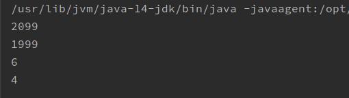

`public Date getTime()`方法

```java
import java.util.Calendar;
import java.util.Date;

public class TestGetTime {
    public static void main(String[] args) {
        Calendar cal = Calendar.getInstance();
        Date date = cal.getTime();
        System.out.println(date);
    }
}
```

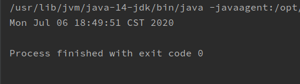

# System类

`java.lang.System`类中提供了大量的静态方法，可以获取与系统相关的信息或系统级操作，常用的方法有：

- `public static long currentTimeMillis()`：返回以毫秒为单位的当前时间。
- `public static void arraycopy(Object src, int srcPos, Object dest, int destPos, int length)`：将数组中指定的数据拷贝到另一个数组中。

## public static long currentTimeMillis()方法

currentTimeMillis方法就是 获取当前系统时间与1970年01月01日00:00点之间的毫秒差值。

```java
package cn.shenzc.java.demo09;

public class TestSystem {
    public static void main(String[] args) {
        long mm = System.currentTimeMillis();
        System.out.println(mm);
    }
}
```


## public static void arraycopy(Object src, int srcPos, Object dest, int destPos, int length)方法

将数组中指定的数据拷贝到另一个数组中。

数组的拷贝动作是系统级的，性能很高。System.arraycopy方法具有5个参数，含义分别为：

| 参数序号 | 参数名称 | 参数类型 | 参数含义             |
| -------- | -------- | -------- | -------------------- |
| 1        | src      | Object   | 源数组               |
| 2        | srcPos   | int      | 源数组索引起始位置   |
| 3        | dest     | Object   | 目标数组             |
| 4        | destPos  | int      | 目标数组索引起始位置 |
| 5        | length   | int      | 复制元素个数         |

```java
package cn.shenzc.java.demo09;

public class TestArrayCopy {
    public static void main(String[] args) {
        int[] origin = {1,2,3,4,5};
        int[] dest = {6,7,8,9,10};
        for (int i = 0; i < origin.length; i++) {
            System.out.print(origin[i] + " ");
        }
        System.out.println();
        for (int i = 0; i < dest.length; i++) {
            System.out.print(dest[i] + " ");
        }
        System.out.println();
        System.arraycopy(origin,2,dest,0,3);
        for (int i = 0; i < origin.length; i++) {
            System.out.print(origin[i] + " ");
        }
        System.out.println();
        for (int i = 0; i < dest.length; i++) {
            System.out.print(dest[i] + " ");
        }
        System.out.println();
    }
}
```

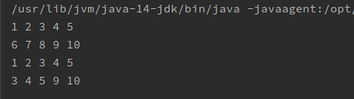

# StringBuilder类

由于String类的对象内容不可改变，所以每当进行字符串拼接时，总是会在内存中创建一个新的对象。例如：

~~~java
public class StringDemo {
    public static void main(String[] args) {
        String s = "Hello";
        s += "World";
        System.out.println(s);
    }
}
~~~

在API中对String类有这样的描述：字符串是常量，它们的值在创建后不能被更改。

根据这句话分析我们的代码，其实总共产生了三个字符串，即`"Hello"`、`"World"`和`"HelloWorld"`。引用变量s首先指向`Hello`对象，最终指向拼接出来的新字符串对象，即`HelloWord` 。由此可知，如果对字符串进行拼接操作，每次拼接，都会构建一个新的String对象，既耗时，又浪费空间。为了解决这一问题，可以使用`java.lang.StringBuilder`类。

## StringBuilder概述

查阅`java.lang.StringBuilder`的API，StringBuilder又称为可变字符序列，它是一个类似于 String 的字符串缓冲区，通过某些方法调用可以改变该序列的长度和内容。

原来StringBuilder是个字符串的缓冲区，即它是一个容器，容器中可以装很多字符串。并且能够对其中的字符串进行各种操作。

它的内部拥有一个数组用来存放字符串内容，进行字符串拼接时，直接在数组中加入新内容。StringBuilder会自动维护数组的扩容。(默认16字符空间，超过自动扩充)

## 构造方法

### public StringBuilder()

构建一个空的StringBuilder对象，其大小为16个字符。

### public StringBuilder(String str)

构建一个StringBuilder对象，并把参数字符串放进去，对象空间为16字符加上参数字符串长度。

### 代码演示

```java
package cn.shenzc.java.demo01;

public class TestStringBuilder {
    public static void main(String[] args) {
        //用StringBuilder的无参构造创建一个对象
        StringBuilder sb1 = new StringBuilder();
        System.out.println("sb1 = " + sb1);
        //用StringBuilder的有参构造创建一个对象
        StringBuilder sb2 = new StringBuilder("Hello");
        System.out.println("sb2 = " + sb2);
    }
}
```

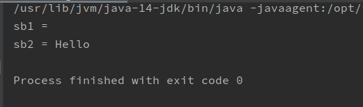

## 成员方法

StringBuilder常用的方法有2个：

- `public StringBuilder append(...)`：添加**任意类型数据的字符串**形式，并返回当前对象自身。
- `public String toString()`：将当前StringBuilder对象转换为String对象。

### 代码演示

```java
package cn.shenzc.java.demo01;

public class TestMethod {
    public static void main(String[] args) {
        //String-->StringBuilder:
        //      可以使用StringBuilder的构造方法
        StringBuilder sb = new StringBuilder("测试字符串");
        System.out.println(sb);
        //调用append方法，往StringBuilder对象里面添加字符串
        sb.append(2);//int类型可以
        System.out.println(sb);
        sb.append(3.2);//double类型可以
        System.out.println(sb);
        sb.append("测试测试");//String 类型可以
        System.out.println(sb);
        //StringBuilder-->String:
        //       可以使用StringBuilder的toString方法
        String s = sb.toString();
        System.out.println(s);
    }
}
```

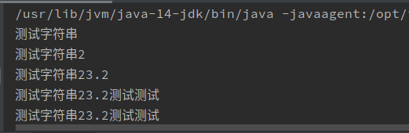

# 基本类型包装类

## 包装类的概念

基本数据类型，使用起来非常方便，但是没有对应的方法来操作这些基本类型的数据。可以使用一个类，把基本类型的数据包装起来，在类中定义一些方法，这个类叫做包装类。我们可以使用包装类中的方法来操作这些基本类型的数据。


| 基本类型 | 对应的包装类（位于java.lang包中） |
| :------- | :-------------------------------- |
| byte     | Byte                              |
| short    | Short                             |
| int      | **Integer**                       |
| long     | Long                              |
| float    | Float                             |
| double   | Double                            |
| char     | **Character**                     |
| boolean  | Boolean                           |

## 装箱与拆箱

装箱：从基本类型转换为对应的包装类对象

拆箱：从包装类对象转换为对应的基本类型

### 装箱

1、构造方法

​	Integer(int value):构造一个新分配的Integer对象，他表示指定的int值

​	Integer(String s):构造一个新分配的Integer对象，他表示String参数所指示的int值。传递的字符串必须是基本类型的字符串，否则会抛异常。

2、静态方法

​	static Integer valueOf(int i):返回一个表示指定int值的Integer对象

​	static Integer valueOf(String s):返回指定的String值的Integer对象。	s中内容必须是int类型。

### 拆箱

成员方法 

​	int intValue():以int类型返回该Integer的值

## 代码演示

```java
package cn.shenzc.java.demo02;

public class TestInteger {
    public static void main(String[] args) {
        //装箱
        //构造方法装箱
        //传入int类型参数
        Integer i1 = new Integer(5);
        System.out.println(i1);
        //传入String类型参数
        Integer i2 = new Integer("44");
        System.out.println(i2);

        //静态方法装箱
        //传入int类型
        int i3 = Integer.valueOf(3);
        System.out.println(i3);
        //传入String类型
        int i4 = Integer.valueOf("55");
        System.out.println(i4);

        //拆箱
         System.out.println(i1.intValue());
        System.out.println(i2.intValue());
    }
}
```

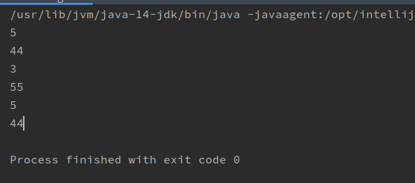

## 自动装箱与自动拆箱

由于我们经常要做基本类型与包装类之间的转换，从Java 5（JDK 1.5）开始，基本类型与包装类的装箱、拆箱动作可以自动完成。例如：

```java
Integer i = 4;//自动装箱。相当于Integer i = Integer.valueOf(4);
i = i + 5;//等号右边：将i对象转成基本数值(自动拆箱) i.intValue() + 5;
//加法运算完成后，再次装箱，把基本数值转成对象。
```

```java
package cn.shenzc.java.demo03;

import java.util.ArrayList;

public class AutoPackage {
    public static void main(String[] args) {
        ArrayList<Integer> list = new ArrayList<>();
        //ArrayList无法直接存储整数，可以存储Integer类
        //这里就把int类型自动包装成了Integer对象
        list.add(6);
        int a = list.get(0);//自动拆箱
    }
}
```

## 基本类型与字符串之间的转换

### 基本类型转换为字符串

1、基本类型的值+ ""  :最简单的方法（常用）

2、包装类的toString方法（参数）：不是Object类的toString方法重载、重写

​	static String toString(int i):返回一个指定整数的String对象。

3、String类的静态方法valueOf(参数)：

​		static String valueOf(int i)

### 字符串到基本数据类型

1、使用包装类的静态方法：

​		Integer类：static int parseInt(String s)

​		Double类：static double parseDouble(String s)

### 代码演示

```java
package cn.shenzc.java.demo04;

public class BasicAndString {
    public static void main(String[] args) {
        //基本类型到String类型
        //1.基本类型 + ""
        int i1 = 5;
        String s1 = i1 + "";
        System.out.println(s1);
        //2.包装类的toString方法
        String s2 = Integer.toString(5);
        System.out.println(s2);
        //3.String类的静态方法
        String s3 = String.valueOf(44);
        System.out.println(s3);

        //String类型到基本类型
        //基本类型的静态方法
        int i2 = Integer.parseInt("34");
        double d1 = Double.parseDouble("3.141592654");
        System.out.println(i2);
        System.out.println(d1);
    }
}
```

