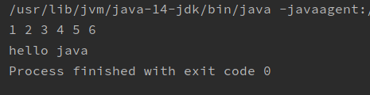

# Collection集合

## 概述


**集合**：集合是java中提供的一种容器，可以用来存储多个数据。

集合与数组的区别

* 数组的长度是固定的。集合的长度是可变的。
* 数组中存储的是同一类型的元素，可以存储基本数据类型值，也可以存储对象。集合存储的都是对象。而且对象的类型可以不一致。在开发中一般当对象多的时候，使用集合进行存储。

java.util.Collection类是所有**单列集合**的根接口；

## 集合框架

JAVASE提供了满足各种需求的API，在使用这些API前，先了解其继承与接口操作架构，才能了解何时采用哪个类，以及类之间如何彼此合作，从而达到灵活应用。

### 学习集合的目标

1.会使用集合存储数据

2.会遍历集合，把数据取出来

3.掌握每种集合的特性

### 集合框架示意图

Java集合类主要是由两个根接口Collection和Map派生出来的。


Collection接口定义的是所有单列集合中共性的方法；所有单列集合都可以使用共性的方法；没有的带索引的方法。

- List接口：有序的集合（存储和取出元素顺序相同）；允许有重复的元素；有索引，可以使用普通的for循环遍历。
- Set接口：不允许存储重复的元素；没有索引，不能使用普通的for循环遍历。TreeSet和HashSet是无序的集合（存储和取出元素顺序可能不同），LinkedHashSet是有序的集合。

集合框架的学习方式：

学习顶层：学习顶层接口/抽象类中共性的方法，所有子类可以使用；

使用底层：顶层不是接口就是抽象类，无法创建对象使用，需要使用底层的子类创建对象使用。

## Collection集合常用的方法

Collection是所有单列集合的父接口，因此在Collection中定义了单列集合(List和Set)通用的一些方法，这些方法可用于操作所有的单列集合。方法如下：

* `public boolean add(E e)`：  把给定的对象添加到当前集合中 。
* `public void clear()` :清空集合中所有的元素。
* `public boolean remove(E e)`: 把给定的对象在当前集合中删除。
* `public boolean contains(E e)`: 判断当前集合中是否包含给定的对象。
* `public boolean isEmpty()`: 判断当前集合是否为空。
* `public int size()`: 返回集合中元素的个数。
* `public Object[] toArray()`: 把集合中的元素，存储到数组中。

### 代码演示

```java
package cn.shenzc.java.demo05;

import java.util.ArrayList;
import java.util.Collection;

public class TestCollection {
    public static void main(String[] args) {
        //使用多态创建一个Collection对象
        Collection<String> list = new ArrayList<>();
        //打印ArrayList对象，重写了toString方法
        System.out.println(list);
        //isEmpty方法判断该集合是否为空，如果为空，则返回true；不为空，则返回false
        System.out.println(list.isEmpty());
        //通过add方法向集合中添加元素，添加成功返回true，添加失败返回false。一般都是添加成功
        list.add("张三");
        list.add("李四");
        list.add("王五");
        list.add("赵六");
        list.add("田七");
        //添加完元素后再次判断集合是否为空
        System.out.println(list.isEmpty());
        //用size方法得到集合中元素的个数
        System.out.println(list.size());
        System.out.println(list);
        //用remove方法删除集合中对应的元素，如果存在该元素则删除该元素返回true；否则返回false
        list.remove("赵六");
        System.out.println(list);
        System.out.println(list.remove("赵四"));
        //用cotains方法判断集合中是否包含指定元素，包含则返回true，否则返回false
        System.out.println(list.contains("赵四"));
        //用toArray方法将集合转为对象数组
        Object[] arr = list.toArray();
        for (int i = 0; i < arr.length; i++) {
            System.out.println(arr[i]);
        }
        //用clear方法，清空集合
        list.clear();
        System.out.println(list.size());
        System.out.println(list);
    }
}
```

## Iterator接口

### 接口介绍

在程序开发中，经常需要遍历集合中的所有元素。针对这种需求，JDK专门提供了一个接口`java.util.Iterator`。`Iterator`接口也是Java集合中的一员，但它与`Collection`、`Map`接口有所不同，`Collection`接口与`Map`接口主要用于存储元素，而`Iterator`主要用于迭代访问（即遍历）`Collection`中的元素，因此`Iterator`对象也被称为迭代器。

想要遍历Collection集合，那么就要获取该集合迭代器完成迭代操作，下面介绍一下获取迭代器的方法：

* `public Iterator iterator()`: 获取集合对应的迭代器，用来遍历集合中的元素的。

下面介绍一下迭代的概念：

* **迭代**：即Collection集合元素的通用获取方式。在取元素之前先要判断集合中有没有元素，如果有，就把这个元素取出来，继续在判断，如果还有就再取出出来。一直把集合中的所有元素全部取出。这种取出方式专业术语称为迭代。

### 常用方法

boolean	hasNext()：Returns true if the iteration has more elements.
E	next()：Returns the next element in the iteration.

Iterator是一个接口，我们无法直接使用，需要使用Iterator的实现类来创建对象使用。但是获取实现类的方法比较特殊，我们可以利用Collection接口中的interator方法的返回值来创建一个Iterator接口的实现类对象。

### 迭代器的使用步骤

1、使用集合中的方法iterator()获取迭代器的实现类对象，使用Iterator接口接收（多态）；(Iterator也是有泛型的，集合是什么泛型，Iterator就是什么泛型)

2、使用Iterator接口中的方法hasNext判断集合中是否还有下一个元素；
3、使用Iterator接口中的方法next取出集合中的下一个元素

### 代码演示

```java
package cn.shenzc.java.demo06;

import java.util.ArrayList;
import java.util.Collection;
import java.util.Iterator;

public class TestIterator {
    public static void main(String[] args) {
        //用多态创建一个Collection对象
        Collection<String> coll = new ArrayList<>();
        //向集合中添加一些元素，可以使用Collection的add方法
        coll.add("张三");
        coll.add("李四");
        coll.add("王五");
        coll.add("赵六");
        coll.add("田七");
        //用Collection接口中的iterator()方法创建一个Iterator接口的实现类对象
        Iterator<String> iterator = coll.iterator();
        //用Iterator接口中的hasNext方法判断集合中是否还有下一个元素，再用next方法获取下一个元素
        while(iterator.hasNext()){
            System.out.println(iterator.next());
        }
    }
}
```


## 增强for循环

增强for循环(也称for each循环)是**JDK1.5**以后出来的一个高级for循环，专门用来遍历数组和集合的。它的内部原理其实是个Iterator迭代器，所以在遍历的过程中，不能对集合中的元素进行增删操作。也叫for-each循环

### 格式

for(数据类型 变量名 : 数组名/集合名){

//其他操作

}

### 代码演示

```java
package cn.shenzc.java.demo07;

public class TestForEach {
    public static void main(String[] args) {
        //定义一个整形数组
        int[] arr1 = {1,2,3,4,5,6};
        //利用增强for循环遍历数组
        for(int i : arr1){
            System.out.print(i + " ");
        }
        System.out.println();
        //定义一个字符串数组
        String[] arr2 = {"hello","java"};
        //用增强for循环遍历
        for(String s : arr2){
            System.out.print(s + " ");
        }
    }
}
```



# 泛型

